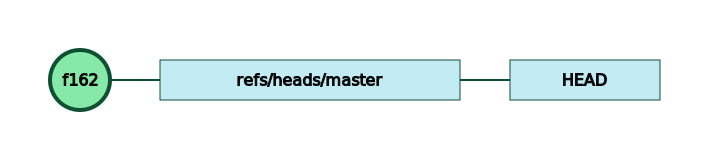
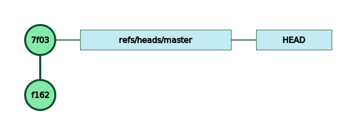
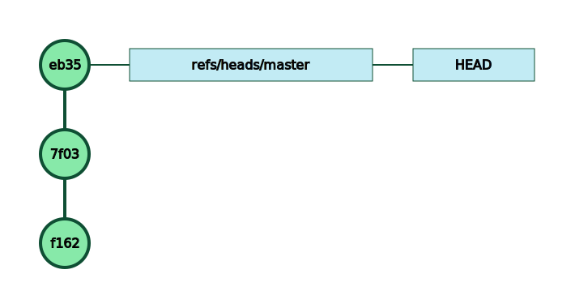

# Introduction


One interesting feature with `git` is that its entire state is stored on your machine, inside the `.git` directory of your repository.


That means that, by observing what is happening in that `.git` directory, you *can* understand what git is trying to do when you type all those pesky commands.


# git init


Let’s start with the command to create a local repository: `git init`


```bash
$ git init
Initialized empty Git repository in <your directory>/.git/
```


This command creates quite a few files inside this `.git` directory:


```plain text
HEAD
config
description
hooks/applypatch-msg.sample
hooks/commit-msg.sample
hooks/fsmonitor-watchman.sample
hooks/post-update.sample
hooks/pre-applypatch.sample
hooks/pre-commit.sample
hooks/pre-push.sample
hooks/pre-rebase.sample
hooks/pre-receive.sample
hooks/prepare-commit-msg.sample
hooks/update.sample
info/exclude
```


We’ll have a look to all those files in subsequent posts, but for now will focus only on 3 types of files:


- the commits which are stored in the `.git/objects` directory

- the references stored in the `refs` directory

- the symbolic references like the `HEAD` file

At this stage, there is only one of those files: the `HEAD` file which contains:


```plain text
ref: refs/heads/master
```


This is a link to a reference which doesn’t exist as we don’t have any commits yet…


# our first commit


Let’s create our first commit:


```bash
$ echo "hello" > hello.txt
$ git add hello.txt
$ git commit -m 'say hello'
[master (root-commit) f1628af] say hello
 1 file changed, 1 insertion(+)
 create mode 100644 hello.txt
```


Tada! we have our first commit and a reference which points to that commit.Nothing too crazy here. Time for a second commit.



Nothing too crazy here. Time for a second commit.


```bash
$ echo "how are you doing?" > greet.txt
$ git add greet.txt
$ git commit -m 'be friendly'
[master 7f03bd8] be friendly
 1 file changed, 1 insertion(+)
 create mode 100644 greet.txt
```


We already see a pattern:





- the new commit has a *parent* reference to the previous one

- the `ref/heads/master` reference is updated to point to our new commit

- `HEAD` keeps the same value which means it also points to the last commit

The process will repeat with our 3rd commit.


```bash
$ echo "bye" > bye.txt
$ git add bye.txt
$ git commit -m 'say bye'
[master eb3562c] say bye
 1 file changed, 1 insertion(+
 create mode 100644 bye.txt
```


As expected, the commit tree is:



Nothing too exciting yet, but we’ll see what happens when we create new branches or connect to a remote repository. 


