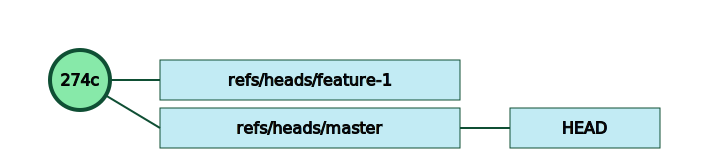
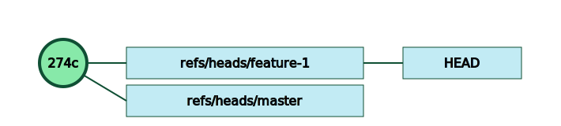
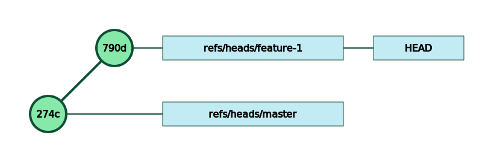
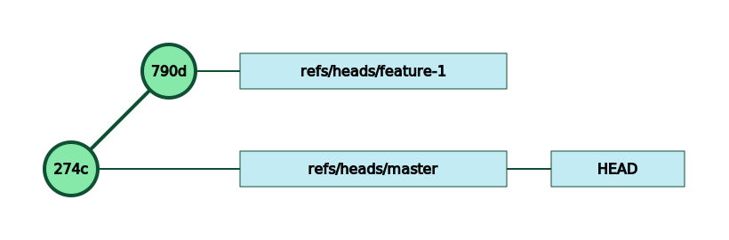
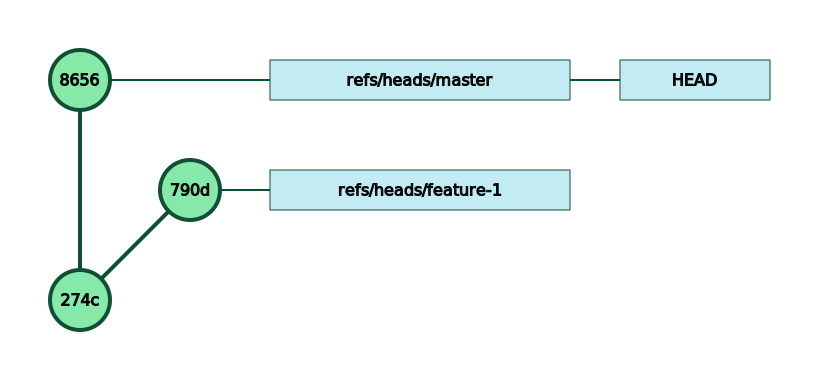

One of the strength of git is the way it handles branches.

Let’s start with 1 commit on master.


and let’s create a branch named `feature-1`:

```bash
$ git branch feature-1
```
Git is very fast at creating branches because it is *only* about creating a pointer:




`HEAD` is a symbolic ref to the branch your working tree is on and is still pointing to master.

If we switch to our new branch, git simply changes the `HEAD` reference

```bash
$ git checkout feature-1
Switched to branch 'feature-1'
```

If we create a file while on that branch and commit it, we then have:




If we switch to master:

```bash
$ git checkout master
Switched to branch 'master'
```
The `HEAD` reference is switched again, and our working directories is updated accordingly.


As expected, if we create a new commit on master, we land on that configuration:



