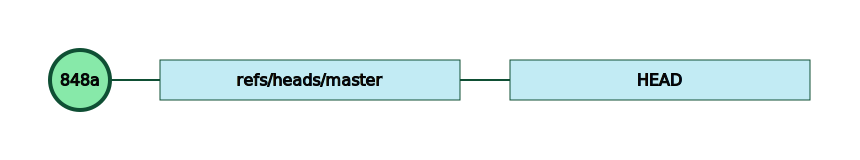
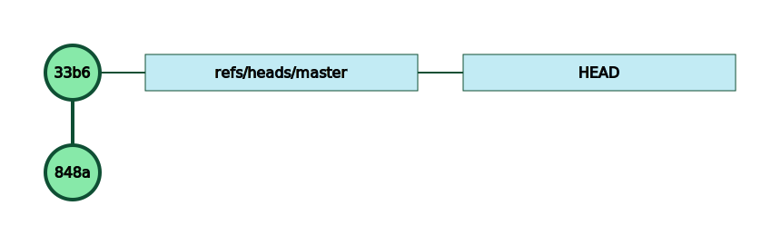
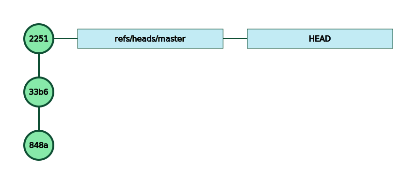
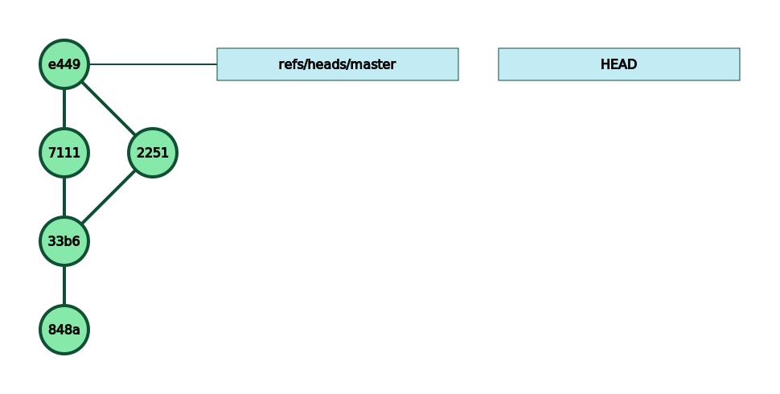

The *classic* usage of git is to work with a remote repository.

Let’s consider `Adele` and `Blair`, 2 developers working on the project `paris`, which is also the name of the repository they are both working on.


Blair starts by cloning the repo.

```bash
$ git clone ssh://remote.mygit.com/git-server/repos/paris.git

Cloning into 'paris'...
remote: Counting objects: 3, done.
remote: Total 3 (delta 0), reused 0 (delta 0)
Receiving objects:  33% (1/3)
Receiving objects:  66% (2/3)
Receiving objects: 100% (3/3)
Receiving objects: 100% (3/3), done.
```
Adele is now the proud of owner of a brand new commit on her machine:


Adele starts to work on that repo and eventually has a commit ready to be pushed.

```bash
$ git push

Enumerating objects: 4, done.
Counting objects:  25% (1/4)   
Counting objects:  50% (2/4)   
Counting objects:  75% (3/4)   
Counting objects: 100% (4/4)   
Counting objects: 100% (4/4), done.
Delta compression using up to 4 threads
Compressing objects:  50% (1/2)   
Compressing objects: 100% (2/2)   
Compressing objects: 100% (2/2), done.
Writing objects:  33% (1/3)   
Writing objects:  66% (2/3)   
Writing objects: 100% (3/3)   
Writing objects: 100% (3/3), 321 bytes | 321.00 KiB/s, done.
Total 3 (delta 0), reused 0 (delta 0)
To ssh://remote.mygit.com/git-server/repos/paris.git
   848af7d..33b6807  master -> master
```
Adele’s commit tree is now:


Adele continues her development and has a new commit ready:


But this time, when she tries to push to her origin server:

```plain text
$ git push

To ssh://remote.mygit.com/git-server/repos/paris.git
 ! [rejected]        master -> master (fetch first)
error: failed to push some refs to 'ssh://remote.mygit.com/git-server/repos/paris.git'
hint: Updates were rejected because the remote contains work that you do
hint: not have locally. This is usually caused by another repository pushing
hint: to the same ref. You may want to first integrate the remote changes
hint: (e.g., 'git pull ...') before pushing again.
hint: See the 'Note about fast-forwards' in 'git push --help' for details.
```


The dreaded git error message.

The `git status` command doesn’t give a lot of information… besides the fact that Adele *must* push her commit:

```bash
$ git status

On branch master
Your branch is ahead of 'origin/master' by 1 commit.
  (use "git push" to publish your local commits)
 
nothing to commit, working tree clean
```


In that specific scenario, the reason for the rejection is easy to guess: her friend Blair has already pushed a new commit to master.

You can *vizualize* the problem by looking at the commit tree on the server.

On the `paris` remote repository, the commit tree is:


There is now a new commit (`2251`) that Adele doesn’t have locally, but Adele has a commit (`7111`) that the remote doesn’t have… Bummer.

*One way* to solve that situation is to follow git’s recommendations and perform a `git pull`:

```plain text
$ git pull

remote: Counting objects: 3, done.
remote: Compressing objects:  50% (1/2)   remote: Compressing objects: 100% (2/2)   remote: Compressing objects: 100% (2/2), done.
remote: Total 3 (delta 0), reused 0 (delta 0)
Unpacking objects:  33% (1/3)   
Unpacking objects:  66% (2/3)   
Unpacking objects: 100% (3/3)   
Unpacking objects: 100% (3/3), done.
From ssh://remote.mygit.com/git-server/repos/paris
   33b6807..2251a9d  master     -> origin/master
Merge made by the 'recursive' strategy.
 README.txt | 1 +
 1 file changed, 1 insertion(+)
```
The commit tree on Adele’s machine looks like this now:


The `git pull` command has created a merge commit (`e449`) to reconciliate the local commit (`7111`) and the remote commit (`2251`).

Forget the wars *vi vs emacs* or *space vs tab* : some developers have an allergic reaction when they encounter merge commits and they would get crazy if they see a commit tree like above.

We’ll see at another time how to avoid this merge commit and, by doing so, to prevent the end of the civilized world.

After this `git pull`, Adele has now 2 commits that the remote doesn’t have:

```plain text
$ git status

On branch master
Your branch is ahead of 'origin/master' by 2 commits.
  (use "git push" to publish your local commits)
 
nothing to commit, working tree clean
```
Time for another push to sync up the remote and Adele’s machine:

```plain text
$ git push

Enumerating objects: 7, done.
Counting objects: 100% (7/7), done.
Delta compression using up to 4 threads
Compressing objects: 100% (4/4), done.
Writing objects: 100% (5/5), 680 bytes | 680.00 KiB/s, done.
Total 5 (delta 0), reused 0 (delta 0)
To ssh://remote.mygit.com/git-server/repos/paris.git
   2251a9d..e4490f9  master -> master
```
And now, the remote has the same commit tree as Adele’s machine:


