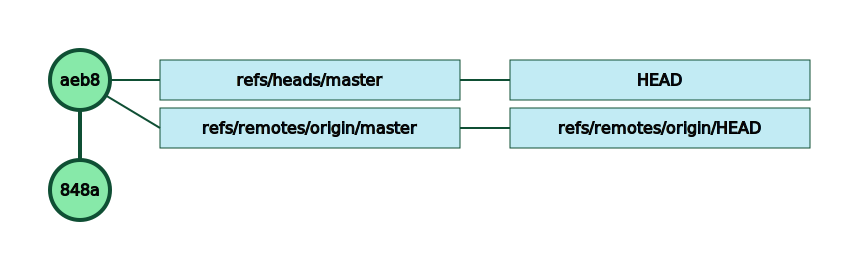
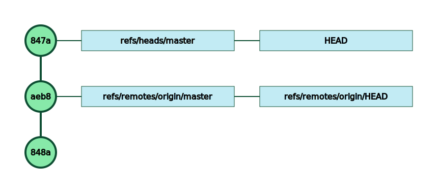
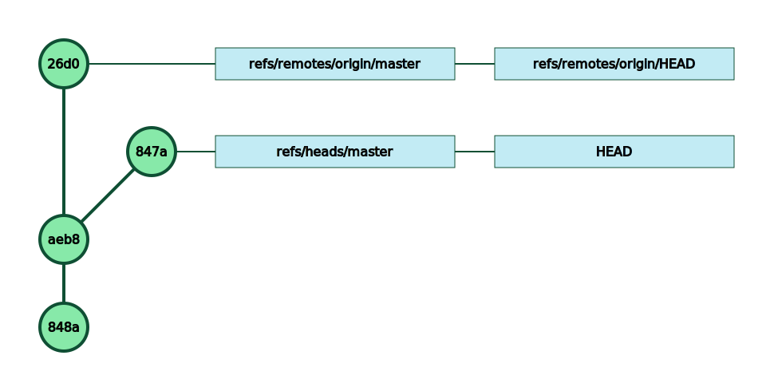
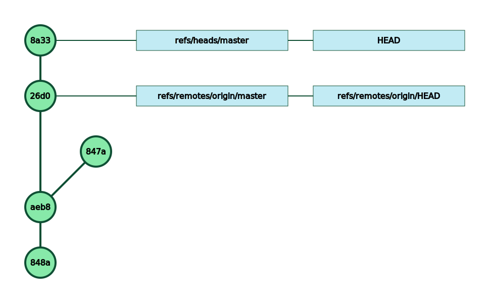
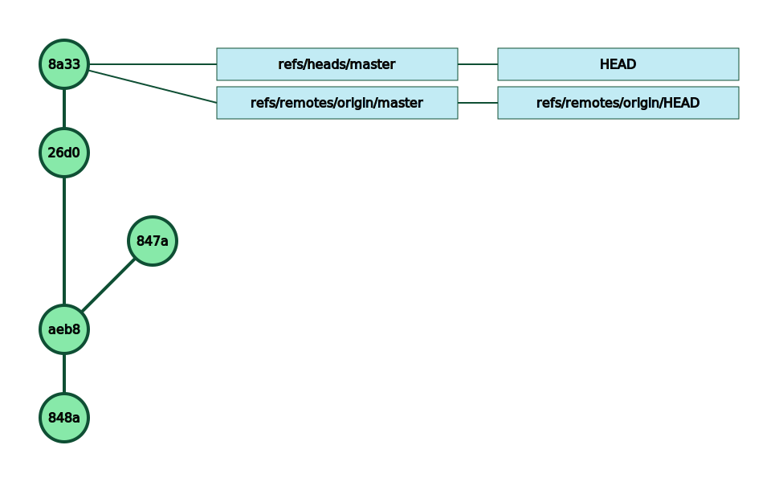
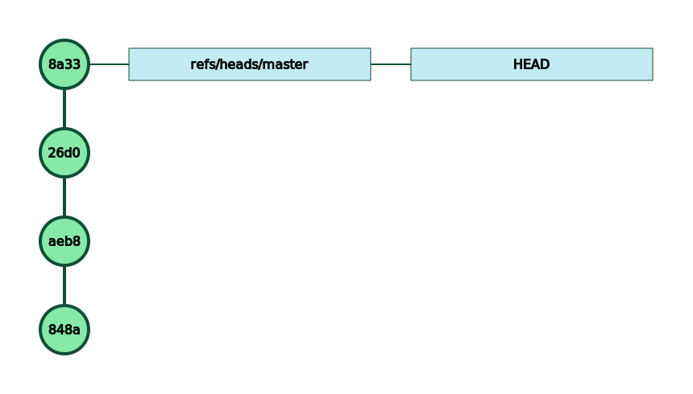

In the previous post, we saw that a `git pull` command could lead to a merge commit.

A lot of developers prefer to have a linear git history and deeply despise those merge commits.

First. A `git pull` doesn’t *always* lead to a merge commit:

```plain text
$ git pull

remote: Counting objects: 3, done.
remote: Total 3 (delta 0), reused 0 (delta 0)
Unpacking objects:  33% (1/3)   
Unpacking objects:  66% (2/3)   
Unpacking objects: 100% (3/3)   
Unpacking objects: 100% (3/3), done.
From ssh://remote.mygit.com/git-server/repos/paris
   848af7d..aeb80a1  master     -> origin/master
Updating 848af7d..aeb80a1
Fast-forward
 README.txt | 1 +
 1 file changed, 1 insertion(+)
```
The important word here is Fast-forward: all the commits on the local machine were already on the remote, so git was able to bring back the new commit without having to create a merge commit.


But, if someone else pushed a commit to the same branch before you had time to push yours, then the `git pull` will create that pesky merge commit. That’s what happened in the previous post.

By default, `git pull` will *try* to perform a fast forward, but if it is not always possible.

To anticipate what will happen, you can either do a `git fetch` to get all the remote commits and to then *assess* the situation.

You can also tell git that you only want to do the `git pull` if a fast forward can be performed.

To prevent a merge commit during a git pull, you can perform the command: `git pull --ff-only`

```plain text
$ git pull --ff-only

remote: Counting objects: 3, done.
remote: Compressing objects:  50% (1/2)   remote: Compressing objects: 100% (2/2)   remote: Compressing objects: 100% (2/2), done.
remote: Total 3 (delta 0), reused 0 (delta 0)
Unpacking objects:  33% (1/3)   
Unpacking objects:  66% (2/3)   
Unpacking objects: 100% (3/3)   
Unpacking objects: 100% (3/3), done.
From ssh://remote.mygit.com/git-server/repos/paris
   aeb80a1..26d005b  master     -> origin/master
fatal: Not possible to fast-forward, aborting.
```


This time the fast forward is not possible so the `git pull` aborts without creating any merge commit.

A `git pull` always performs a `git fetch`first, meaning that all the commits are now on your local machine for you to assess.

Before the `git fetch`:


After the git fetch:


This new tree shows that:


* your working directory has not changed: `HEAD` still points to your last commit
* the `refs/remotes` references shows you what is happening on the server: the commit `26d0` is the commit which prevents the fast forward.

To solve that connundrum, the solution is to perform a `git rebase`.

The rebase will bring back the remote commits and then try to reapply your local changes on top of those commits.

```plain text
$ git rebase origin/master

First, rewinding head to replay your work on top of it...
Applying: Hello from Adele
Using index info to reconstruct a base tree...
M   README.txt
Falling back to patching base and 3-way merge...
Auto-merging README.txt
CONFLICT (content): Merge conflict in README.txt
error: Failed to merge in the changes.
Patch failed at 0001 Hello from Adele
hint: Use 'git am --show-current-patch' to see the failed patch
 
Resolve all conflicts manually, mark them as resolved with
"git add/rm <conflicted_files>", then run "git rebase --continue".
You can instead skip this commit: run "git rebase --skip".
To abort and get back to the state before "git rebase", run "git rebase --abort".
```
In our current test scenario, the rebase is not smooth : both our local commit and the remote commit changed the same file `README.txt` file.

```plain text
$ cat README.txt

Repo paris created
Hello from Blair.
<<<<<<< HEAD
Another message from Blair.
=======
Hello from Adele.
>>>>>>> Hello from Adele
```
Here, the conflict is easy to fix:

```plain text
$ cat README.txt

Repo paris created
Hello from Blair.
Hello from Adele.
Another message from Blair.
```
Once you have resolved the conflict(s), you follow the instructions given by git:


* you `git add` the files you have changed during the conflicts resolution
* you complete the rebase with `git rebase --continue`

```plain text
$ git add README.txt

$ git rebase --continue

Applying: Hello from Adele
```
Now your commit tree looks like that:


You are back to a situation where you can push your commit tree to the remote — unless someone beat you to the punch and already pushed a new commit to the remote.

The `847a` commit is *still* there. The `git rebase` did not destroy it.

There is no references to that dangling commit though, and it will be *garbage collected* (aka deleted) by git *at some point* in the future. That also means that you still have the opportunity to revive it if needed using `reflog` (more on that another day)

Time for a final `git push`:

```plain text
$ git push

Enumerating objects: 5, done.
Counting objects:  20% (1/5)   
Counting objects:  40% (2/5)   
Counting objects:  60% (3/5)   
Counting objects:  80% (4/5)   
Counting objects: 100% (5/5)   
Counting objects: 100% (5/5), done.
Delta compression using up to 4 threads
Compressing objects:  50% (1/2)   
Compressing objects: 100% (2/2)   
Compressing objects: 100% (2/2), done.
Writing objects:  33% (1/3)   
Writing objects:  66% (2/3)   
Writing objects: 100% (3/3)   
Writing objects: 100% (3/3), 314 bytes | 314.00 KiB/s, done.
Total 3 (delta 0), reused 0 (delta 0)
To ssh://remote.mygit.com/git-server/repos/paris.git
   26d005b..8a33541  master -> master
```
As expected, your commit tree is now:


If you have a sneak peek on the server commit tree:


Mission accomplished. A nice linear history of commits. End of the civilized world averted.


