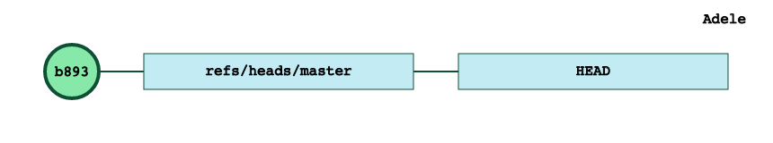
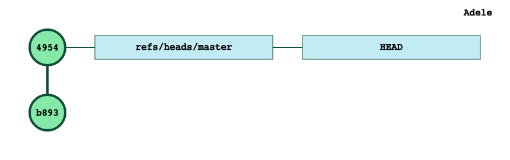
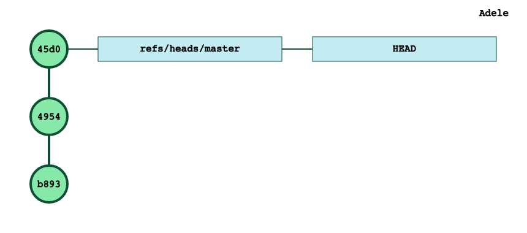
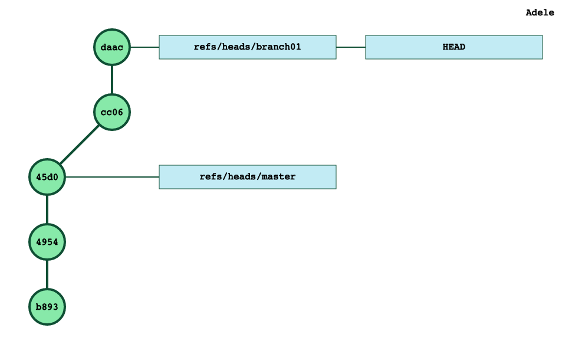
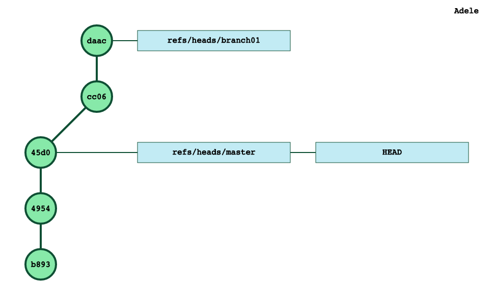

So far, we have been mostly interested in git commits trees, and not so much about how those commits were created.

Time to fill that gap.

# Different areas in git
When working with git, there are three different areas to consider.

## **the git repository**
That’s where git stores all the commits and their associated metadata information.

All those files are stored in the `.git` directory.

## **the working directory**
This directory is the developer’s workspace on her computer’s filesystem. The files in that directory are *regular* files which constitute the content of the project.

## **the staging area**
Git’s primary responsibility is to allow the transition of data between the working directory and the git repository:


* when a user clones a repository or checks out a branch, git must convert a set of commits in plain old files in the working directory
* when a user wants to commit her work, git must convert data from the working directory into commits in the git repository

The staging area is the *buffer* between the git repository and the working directory.

In terms of *shape*, the staging area is very much like a commit. It contains information about files and directories, and like commits, the staging area refers to *blobs* and *trees* for the git database and not files from the working directory.

The staging area is the mechanism which allows the developer to build her next commit.

The content of the staging area is in a single file: `.git/index`

# **Exploration time**
Let’s start from an empty repository and create our first file.

```plain text
$ date > A.txt
$ git status
On branch master
No commits yet
Untracked files:
  (use \"git add <file>...\" to include in what will be committed)
    A.txt
nothing added to commit but untracked files present (use \"git add\" to track)
```
At this stage, the staging area doesn’t even exist, no commit has been created and there is a file `A.txt` in your working directory.

The first step to prepare a commit is to do a `git add`:

```plain text
$ git add A.txt
```
This will create the staging area (`.git/index file`) and you can see it’s content with the git ls-files command:

```plain text
$ git ls-files --stage
100644 0bca567a0af4853378234308e2a0b26a2f0abe54 0    A.txt
```
But no commits has been created yet:

```plain text
$ git status
On branch master
No commits yet
Changes to be committed:
  (use \"git rm --cached <file>...\" to unstage)
    new file:   A.txt
```
Time to create our first commit:

```plain text
$ git commit -m 'first file'
[master (root-commit) b893588] first file
 1 file changed, 1 insertion(+)
 create mode 100644 A.txt
```
This time we have out first commit:


This does not change the content of our staging area:

```plain text
$ git ls-files --stage
100644 0bca567a0af4853378234308e2a0b26a2f0abe54 0    A.txt

```
In a *clean* situation, the staging area is a copy of our current commit (`HEAD`).

Let’s create another file and *git add* it: this will add that file to our staging area:

```plain text
$ date > B.txt
$ git add B.txt
$ git ls-files --stage
100644 0bca567a0af4853378234308e2a0b26a2f0abe54 0    A.txt
100644 d5edb504d978f963a5cc6f2adaf8acf7014e2f3e 0    B.txt
```
This staging area allows git to provide a status about the intent of the developer:

```plain text
$ git status
On branch master
Changes to be committed:
  (use \"git reset HEAD <file>...\" to unstage)
    new file:   B.txt
```
At this stage, we can modify B.txt right?

```plain text
$ date >> B.txt
```
The git status result is interesting after that change:

```plain text
$ git status
On branch master
Changes to be committed:
  (use \"git reset HEAD <file>...\" to unstage)
    new file:   B.txt
Changes not staged for commit:
  (use \"git add <file>...\" to update what will be committed)
  (use \"git checkout -- <file>...\" to discard changes in working directory)
    modified:   B.txt
```
The file `B.txt` appears in 2 sections of the status description:


* because this file is in the staging area, this file is marked as a new file to be committed
* but its content in the working directory is different from what is in the staging area, so this file is also marked as a *non staged* file

If we `git add` that file:

```plain text
$ git add B.txt
```
The staging area is now:

```plain text
$ git ls-files --stage
100644 0bca567a0af4853378234308e2a0b26a2f0abe54 0    A.txt
100644 169638e3aaacc9efbd9b5664cb718292271934f1 0    B.txt
```
Same 2 files as before *but* the astute reader will notice that the sha1 for `B.txt` is different (is now`169638` and was `d5edb5` before)

That is the file which will be commited now:

```plain text
$ git commit -m 'second file'
[master 495430b] second file
 1 file changed, 2 insertions(+)
 create mode 100644 B.txt
```

We can also delete this file

```plain text
$ rm B.txt
$ git status
On branch master
Changes not staged for commit:
  (use \"git add/rm <file>...\" to update what will be committed)
  (use \"git checkout -- <file>...\" to discard changes in working directory)
    deleted:    B.txt
no changes added to commit (use \"git add\" and/or \"git commit -a\")
```
The staging area has not changed, so git can report that there is an uncommited change (the deletion of `B.txt`).

Thanks to the staging area, we can revive that file:

```plain text
$ git checkout B.txt
$ git status
On branch master
nothing to commit, working tree clean
```
But we could also move forward with the deletion:

```plain text
$ rm B.txt
$ git rm B.txt  # git add B.txt would work too!
$ git status
On branch master
Changes to be committed:
  (use \"git reset HEAD <file>...\" to unstage)
    deleted:    B.txt
```
and now the staging area is back to 1 file and we can update our repository accordingly:

```plain text
$ git ls-files --stage
100644 0bca567a0af4853378234308e2a0b26a2f0abe54 0    A.txt
$ git commit -m 'remove B.txt'
[master 45d0ee3] remove B.txt
 1 file changed, 2 deletions-)
 delete mode 100644 B.tx
```

Finally, let’s suppose that we have a branch branch01 with 2 commits :


As usual, the staging area is a copy of our current HEAD commit:

```plain text
$ git ls-files --stage
100644 0bca567a0af4853378234308e2a0b26a2f0abe54 0    A.txt
100644 533f481382e4855bdd7a81aa54fb9737e49de055 0    C.txt
100644 f6dff21336221ade8dc313a4f018afab6dd43146 0    D.txt
```
We can vizualize the fact that the staging area is actually some sort of a copy of the HEAD commit (daac) by listing the content of that commit:

```plain text
$ git cat-file -p daac
tree 2db45b3c2cb2c9ee7e9129c64f47f135902193d7
parent cc063e668d960cc9b553e5f1229a46df6287f594
author Pierre Carion <pcarion@gmail.com> 1572196890 -0700
committer Pierre Carion <pcarion@gmail.com> 1572196890 -0700
add D.txt
```
The key element here is the `tree` reference (`2db45`) which is a description of the tree associated to that commit.

We can also explore the content of that tree:

```plain text
$ git cat-file -p 2db45b3c2cb2c9ee7e9129c64f47f135902193d7
100644 blob 0bca567a0af4853378234308e2a0b26a2f0abe54    A.txt
100644 blob 533f481382e4855bdd7a81aa54fb9737e49de055    C.txt
100644 blob f6dff21336221ade8dc313a4f018afab6dd43146    D.txt
```
Which is exactly the content of our staging area:

```plain text
git ls-files --stage
100644 0bca567a0af4853378234308e2a0b26a2f0abe54 0    A.txt
100644 533f481382e4855bdd7a81aa54fb9737e49de055 0    C.txt
100644 f6dff21336221ade8dc313a4f018afab6dd43146 0    D.txt
```
And each time we switch branch, not only the HEAD reference will be updated to match the new current branch, but the staging area will be updated to match also the content of the new top commit:

```plain text
$ git checkout master
Switched to branch 'master'
$ git ls-files --stage
100644 0bca567a0af4853378234308e2a0b26a2f0abe54 0    A.txt

```
