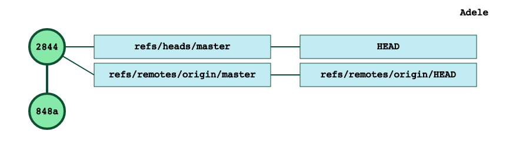
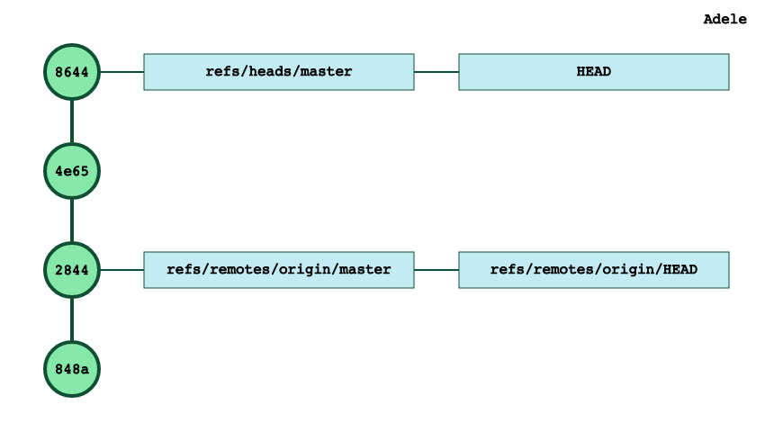
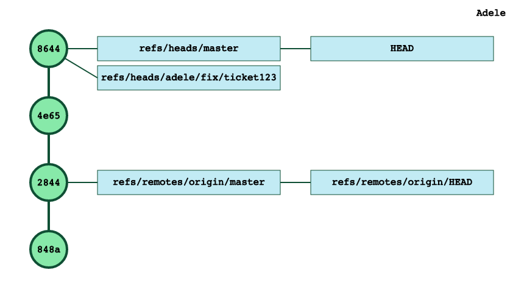
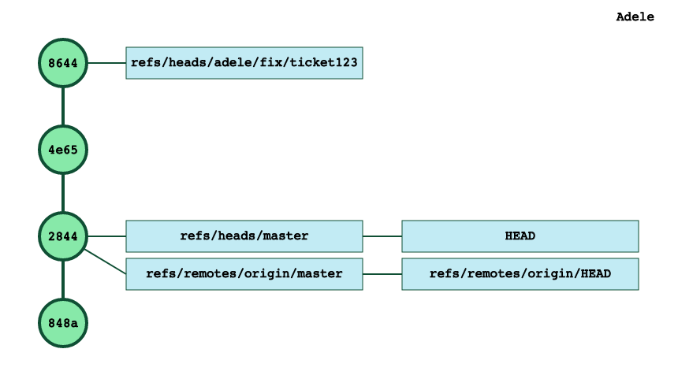
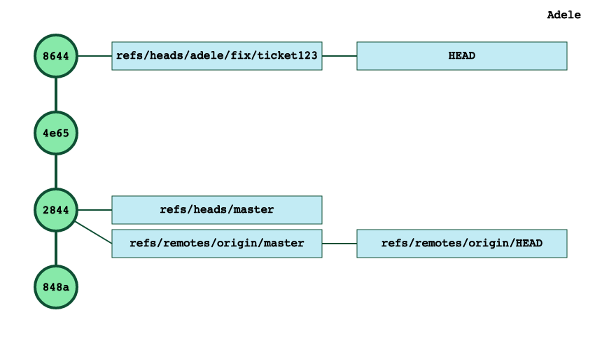
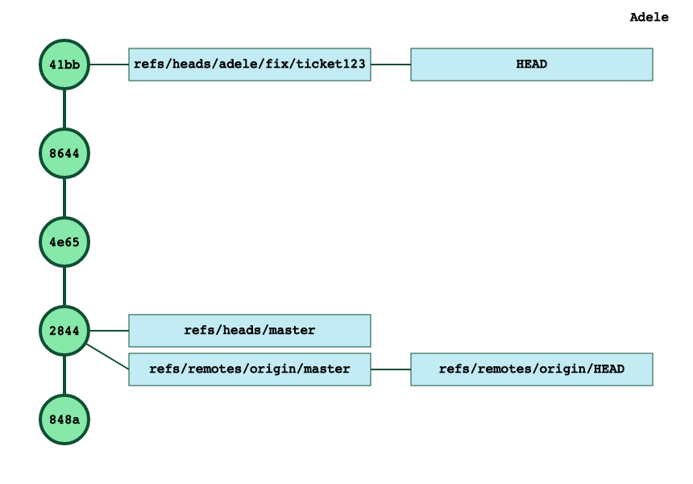
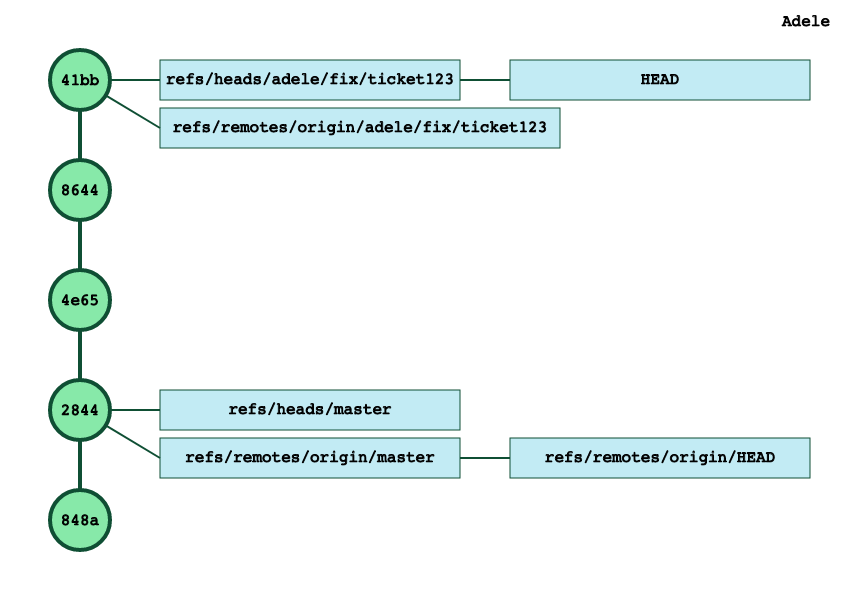
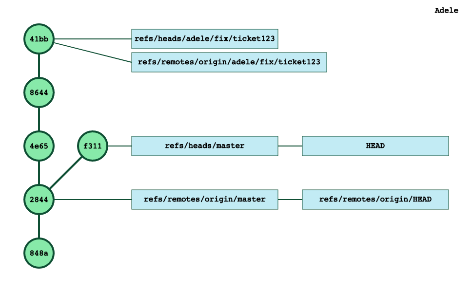
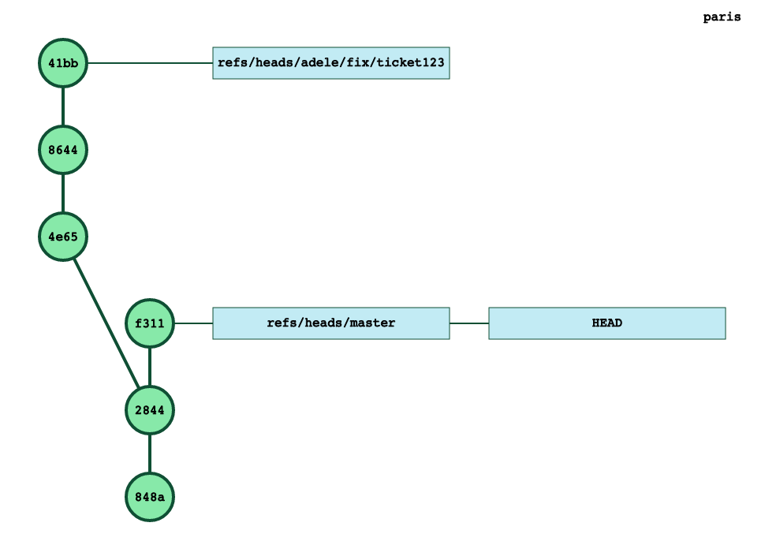

You’re working on a fix and you created a couple of commits before you realize that those commits should be on a different branch, and not on `master`.

How do you fix that?

As we already saw in the previous posts, git’s data structure is *just* a tree with labels on some nodes. That’s it.

The git cli offers a couple of commands to help you reshape your tree in *nearly* any shape you want.

**Note**: if you have already pushed your tree to a remote, you could still change your tree and push it (with the --force option) to the server. Think twice before doing that. That would be really annoying for your coworkers who would have already taken the commits you want to change. More on that another day.

Adele starts from a repo with a couple commits on master.


Then Adele starts working on a fix and has 2 new commits on master.


Before she pushed to the remote, she realizes that those last 2 commits should not be on `master` but on a branch dedicated to the fix: `adele/fix/ticket123`

How to fix that?

First, Adele wants the top of this branch to points to our last commit right? Easy enough, let’s create the branch now:

```javascript
$ git branch adele/fix/ticket123
```
And now Adele’s tree is like that:


First half of the problem solved. The fix branch is created and points to her last commit.

Second half of the problem is that Adele’s `master` branch is not where it *should* be: it should be pointing to the commit `2844` which is 2 commits *up* our current *HEAD*.

The `git reset` command is the swiss army knife for that kind of situation:

```javascript
$ git reset HEAD~2 --hard

HEAD is now at 2844fb3 add first.txt
```
Note: The --hard command may be destructive as it restores both the staging index and your working directory to match what you had at that specific commit. Be sure to backup or stash before running that command.

Tada! Adele’s commit tree is now:


Adele has *reshaped* the commit tree the way it would have been if she would have created the branch, and switched to it, before creating her 2 last commits!

Adele can now switch to that branch and continues her work.

```javascript
$ git checkout adele/fix/ticket123

Switched to branch 'adele/fix/ticket123'
```
The `HEAD` symbolic ref points now to the branch.


And the new commits will go in that branch:


Time to push to the server.

```javascript
$ git push

fatal: The current branch adele/fix/ticket123 has no upstream branch.
To push the current branch and set the remote as upstream, use
 
    git push --set-upstream origin adele/fix/ticket123
```
The server doesn’t know where to push that branch, so Adele needs to tell git, by typing the command that git was gracious enough to list above.

```javascript
$ git push --set-upstream origin adele/fix/ticket123

Enumerating objects: 10, done.
Counting objects:  10% (1/10)
Counting objects: 100% (10/10), done.
Delta compression using up to 4 threads
Compressing objects:  16% (1/6)
Compressing objects: 100% (6/6), done.
Writing objects:  11% (1/9)
Writing objects: 100% (9/9), 834 bytes | 834.00 KiB/s, done.
Total 9 (delta 2), reused 0 (delta 0)
To ssh://remote.mygit.com/git-server/repos/paris.git
 * [new branch]      adele/fix/ticket123 -> adele/fix/ticket123
Branch 'adele/fix/ticket123' set up to track remote branch 'adele/fix/ticket123' from 'origin'.
```
The tree is back to a proper state.



If Adele switches back to master

```javascript
$ git checkout master

Switched to branch 'master'
Your branch is up to date with 'origin/master'.
```
and creates a new commit (`f311`):


To confirm that all is in order, we can have a quick look at the servers’s commit tree:


Problem solved!
