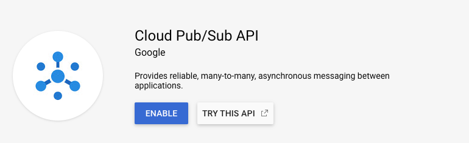
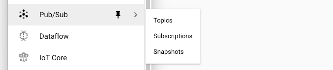
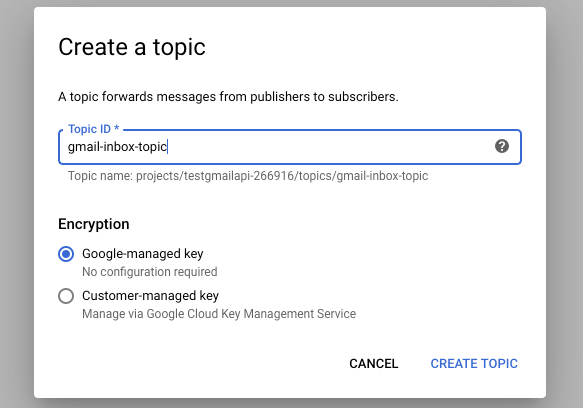
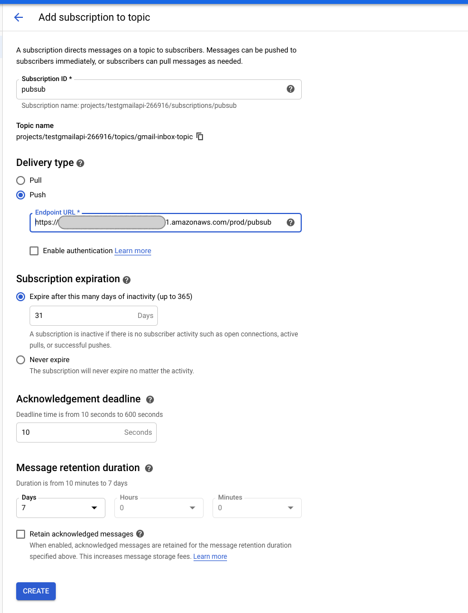
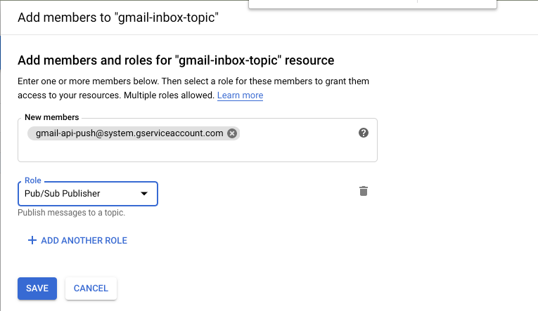

# Don't call us, we'll call you


In the [previous post](https://pcarion.com/blog/node-gmail-api), we saw how we can easily access in a secure manner your mailbox from a headless node program.


If you want to automate a process on reception of a message, you would have to poll this mailbox. 


This would totally inefficient and a waste of resources.


In an article titled "[Gmail API Push notifications: don't call us, we'll call you](https://cloud.google.com/blog/gmail-api-push-notifications-dont-call-us-well-call-you)", the Google team explains how to use the Cloud Pub/Sub API to solve that issue: you can be automatically notified when a message arrives in your mail box.


In order to receive those notifications, you need to:


- provide a web hook URL. Google Cloud will POST a message to that URL each time a message is received.

- enable the Cloud Pub/Sub API in your previously created Google application (see [previous post](https://pcarion.com/article/node-gmail-api))

- create a pup/sub topic

- create a subscription to that topic and add the webhook URL as the push delivery mechanism

- authorize Gmail API to use the pub/sub topic

- configure Gmail to send notifications to the pub/sub topic

A lots of steps indeed, but they are all pretty simple.


# Create a web hook URL


For that post, I will create an AWS lambda, behind and API Gateway using the CDK.


## lambda code for the web hook


The code of that lambda will be really simple: we just want to check that we are actually notified when a message is received.


In a real application, this lambda would use the Google API to read the mail that was just received.


The code of the lambda is:


```javascript
export const handler = async (event: any = {}): Promise<any> => {
  const response = {
    statusCode: 200,
    body: JSON.stringify('Hello from pubsub.handler!'),
  };
  console.log('Event received:');
  console.log(event);
  return response;
};
```


By default in AWS Lambda, the `console.log` statements end up in `cloudwatch` so we'll use the AWS console to check the output.


## lambda creation


As always with AWS, the tricky part is to provision the lambda, and you have several options for that:


- use the AWS console

- write a cloudformation file

- use a framework like [serverless](https://serverless.com/) , [SAM](https://aws.amazon.com/serverless/sam/) or [pulumi](https://www.pulumi.com/)

I opted to use the [AWS Cloud Development kit (CDK)](https://aws.amazon.com/cdk/) because it allows you to provision your resources as code.


The installation of the CDK is simple: 


```bash
$ yarn global add aws-cdk --prefix /usr/local
$ cdk --version
1.22.0 (build 309ac1b)
```


You install a couple of CDK components depending on the resources you want to provision. 


For our demo, we need:


- `@aws-cdk/aws-apigateway`

- `@aws-cdk/aws-lambda`

- `@aws-cdk/core`

Then you *programatically declare *the API endpoint that you want to create with the lambda associated to it:


```javascript
import 'source-map-support/register';
import * as cdk from '@aws-cdk/core';
import lambda = require('@aws-cdk/aws-lambda');
import * as apigateway from '@aws-cdk/aws-apigateway';

export class GmailPubSubEndPointStack extends cdk.Stack {
  constructor(scope: cdk.Construct, id: string, props?: cdk.StackProps) {
    super(scope, id, props);

    // The code that defines your stack goes here
    const api = new apigateway.RestApi(this, 'gmailPubSubEndPoint', {
      restApiName: 'gMail PubSub End Point'
    });

    const pubsubLambda = new lambda.Function(this, 'pubsubLambdaFunction', {
      code: new lambda.AssetCode('dist/lambda'),
      handler: 'pubsub.handler',
      runtime: lambda.Runtime.NODEJS_10_X,
      environment: {
        PRIMARY_KEY: 'itemId'
      }
    });

    const items = api.root.addResource('pubsub');
    const pubsubIntegration = new apigateway.LambdaIntegration(pubsubLambda);
    items.addMethod('GET', pubsubIntegration); // NOT required - for test only
    items.addMethod('POST', pubsubIntegration);
  }
}

const app = new cdk.App();
new GmailPubSubEndPointStack(app, 'GmailPubSubEndPointStack');
app.synth();
```


The `CDK` is still relatively new in the AWS ecosystem and the documentation is still a bit rough.


For instance, when you want to deploy the resources you have declared above, you run `cdk deploy`, but the first time I did that, I got an error:


```plain text
failed: Error: This stack uses assets, so the toolkit stack must be deployed to the environment (Run "cdk bootstrap aws://unknown-account/unknown-region")
```


After a little bit of googling, this error appears to be related to the fact that we need first another cloudformation stack to manage the s3 bucket for the lambda assets.


To do so, you need first to run the command:


```plain text
cdk bootstrap
```


and then, the `cdk deploy` command works:


```plain text
Outputs:
GmailPubSubEndPointStack.gmailPubSubEndPointEndpoint3EC5E7B1 = https://redacted.execute-api.us-west-1.amazonaws.com/prod/
```


As we added a GET endpoint in the API definition, you can confirm in your browser that the endpoint URL returns the `"Hello from pubsub.handler!"` message.


Now that the web hook URL is ready, we can configure the pub/sub part of the problem.


# Enable the Cloud Pub/Sub API


We go back to the application we created in the [previous post](https://pcarion.com/article/node-gmail-api), and we enable the Cloud Pub/Sub API:



# Create a topic


Once you have enabled the API, you need to go the [Cloud Console](https://console.cloud.google.com/home/dashboard), in the Pub/Sub page:



from that page, you click on "CREATE TOPIC":



# Create a subscription to that topic


A subscription is the actual channel used by gmail to notify that a mail has been received:



In the "Delivery type" section, you configure the fact that you want the notifications to be pushed to the URL we created in the previous section.


# Authorize Gmail API to use the topic


We need to tell Cloud Pub/Sub to grant Gmail privileges to publish notifications to your topic:


- the member identification is [gmail-api-push@system.gserviceaccount.com](mailto:gmail-api-push@system.gserviceaccount.com)

- you need to add this member to the topic, not the susbcription 


## Configure Gmail to send notifications


Once the initial Cloud Pub/Sub setup is finished, you must configure Gmail to send notifications when a message is received. 


The API to do that is `gmail.users.watch`: set up or update a push notification watch on the given user mailbox


Using the authentication code we did in [our previous post](https://pcarion.com/article/node-gmail-api), we can create a watch request:


```javascript
const { google } = require('googleapis');
const getOauth2Client = require('./getOauth2Client');

getOauth2Client().then(auth => {
  var gmail = google.gmail({
    version: 'v1',
    auth: auth,
  });
  gmail.users.watch({
    userId: 'me',
    resource: {
      'labelIds': ['INBOX'],
      topicName: `projects/testgmailapi-266916/topics/gmail-inbox-topic`
    }
  }, (err, res) => {
    if (err) {
      throw err;
    }
    console.log(res.data);
  });
});
```


If all goes well, you should see an ouput like this one:


```bash
$ node watch.js
{ historyId: '1672', expiration: '1581292279087' }
```


The pub/sub docUmentation says that: *You must re-call watch() at least every 7 days or else you will stop receiving updates for the user. We recommend calling watch() once per day. The watch() response also has an expiration field with the timestamp for the watch expiration.*


An easy solution for that is to create another lambda with a daily cron notification.


## Test the pub/sub notification


The final step is to confirm that a pub/sub notification is triggered when you receive a mail in your inbox.


To do so, you simply send a mail to that inbox and then check the could watch log of your lambda to see if an event was received.


In cloud watch, you should see a message like this one:


```json
{
  "message": {
    "data": "eyJlbWFpbEF...CI6MTc0NH0=",
    "messageId": "442571078954424",
    "message_id": "442571078954424",
    "publishTime": "2020-02-02T23:56:05.77Z",
    "publish_time": "2020-02-02T23:56:05.77Z"
  },
  "subscription": "projects/testgmailapi-266916/subscriptions/pubsub"
}
```


The data part is a base64 encoding of:


```json
{"emailAddress":"ddiderot25@gmail.com","historyId":1744}
```


In a real situation, the lambda would then read the message and process it. 


The gmail API has an API to read a message:


```javascript
const { google } = require('googleapis');
const getOauth2Client = require('./getOauth2Client');

getOauth2Client().then(auth => {
  var gmail = google.gmail({
    version: 'v1',
    auth: auth,
  });
  const messageId = '17008552cd6b1ae9';
  gmail.users.messages.get({
    'userId': 'me',
    'id': messageId
  }, (err, res) => {
    if (err) {
      console.log('error:', err);
    } else {
      console.log(JSON.stringify(res, null, '  '));
    }
  });
});
```


Unfortunately, the `messageId` provided in the notification is not the id of the message received in the mail box (I guess it is the message id in the pubsub system), so you need first to read the inbox to retrieve the list of messages:


```javascript
const { google } = require('googleapis');
const getOauth2Client = require('./getOauth2Client');

getOauth2Client().then(auth => {
  var gmail = google.gmail({
    version: 'v1',
    auth: auth,
  });

  gmail.users.messages.list(
    {
      userId: 'me',
    },
    (err, res) => {
      if (err) {
        return console.log('The API returned an error: ' + err);
      } else {
        console.log(JSON.stringify(res, null, '  '));
      }
    }
  );
});
```


This call will tell you the `messageId` of all the messages in the inbox.


# cleanup


You can easily disable the notification through the gmail `gmail.users.stop` method:


```javascript
const { google } = require('googleapis');
const getOauth2Client = require('./getOauth2Client');

getOauth2Client().then(auth => {
  var gmail = google.gmail({
    version: 'v1',
    auth: auth,
  });
  gmail.users.stop({
    userId: 'me'
  }, (err, res) => {
    if (err) {
      throw err;
    }
    console.log(res);
  });
});
```


# References


- [CDK API reference](https://docs.aws.amazon.com/cdk/api/latest/docs/aws-construct-library.html)

- [AWS CDK examples repository](https://github.com/aws-samples/aws-cdk-examples)

- [gmail API reference](https://developers.google.com/gmail/api/v1/reference)


